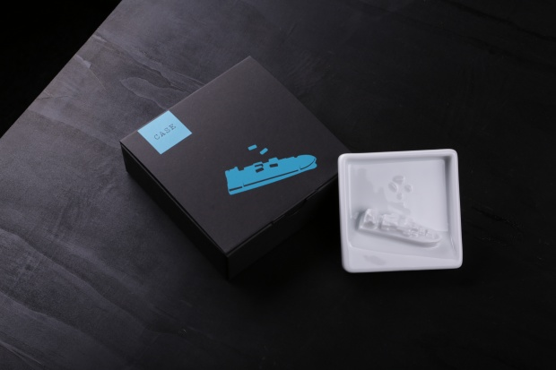
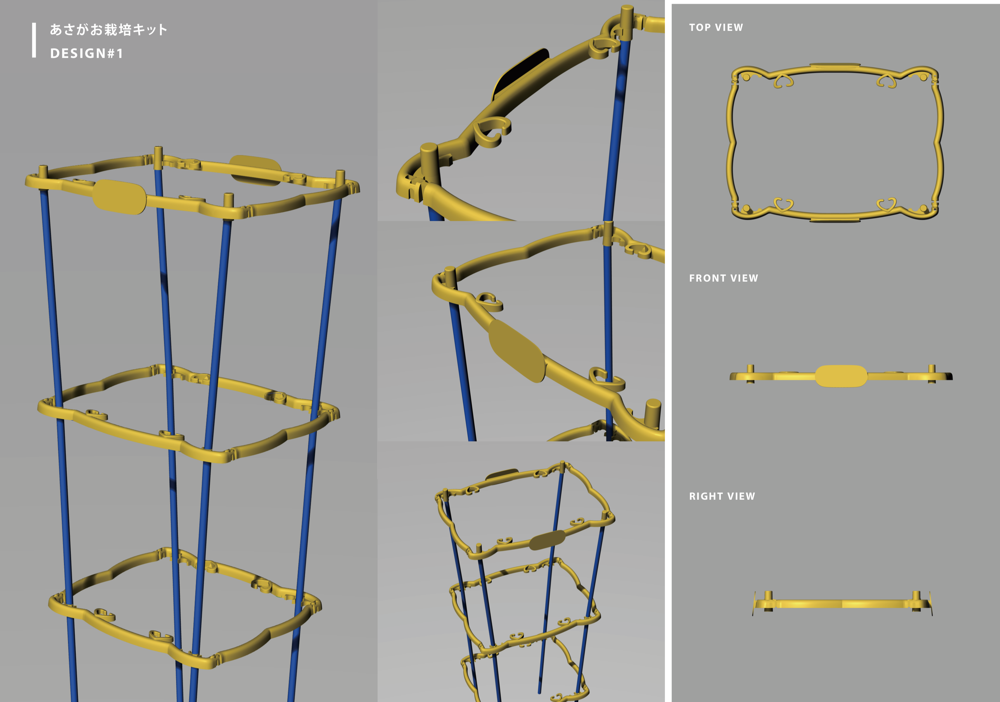

### Design Background

The shipping of oil accounts for over 2/1 of the world’s shipping capacity. In addition to using heavy oil as their fuel, the massive tankers that transport the oil are susceptible to oil spills that are
responsible for some of the worst environmental crises of our era. The next time you dip your sashimi into this sauce dish, think again. While oil spills often happen in remote areas, the consequences
are global and even influence the food on our plates.

