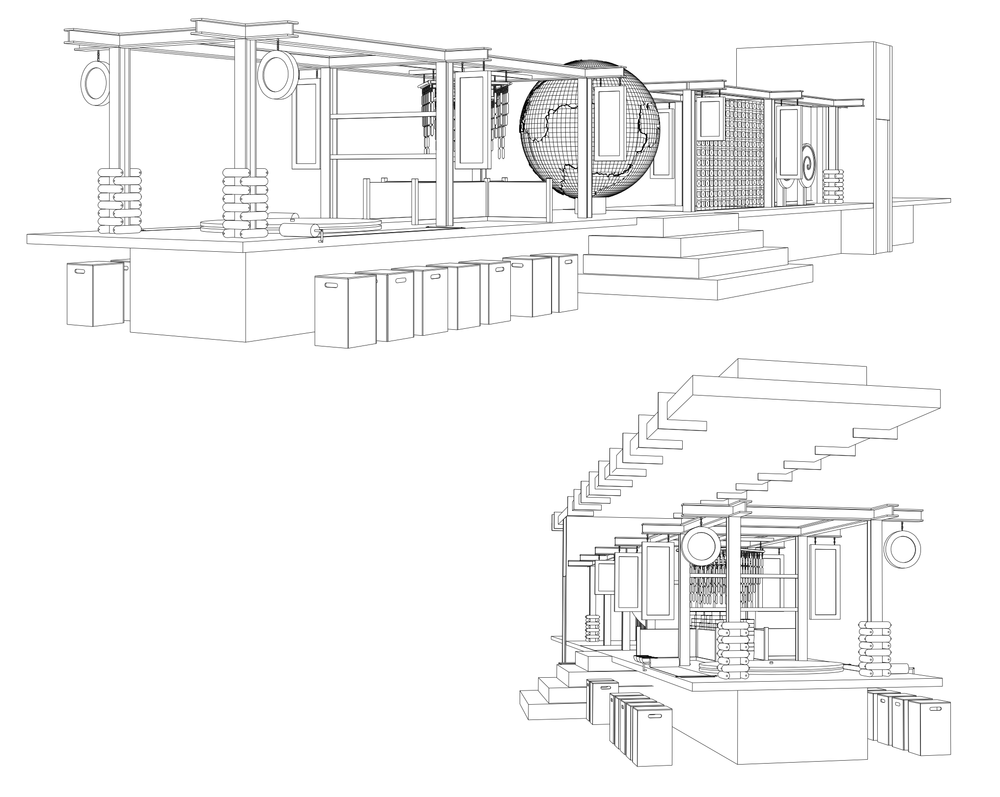
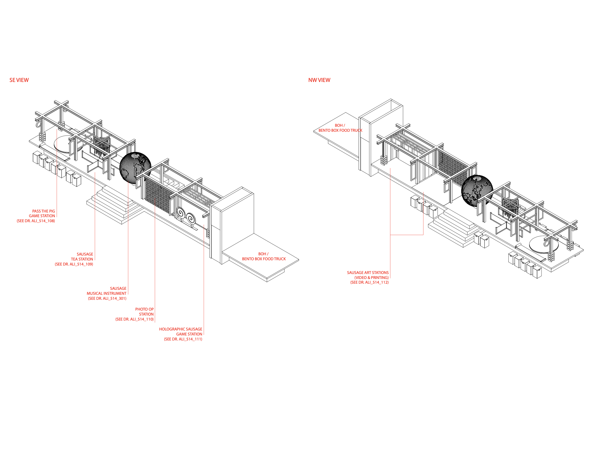
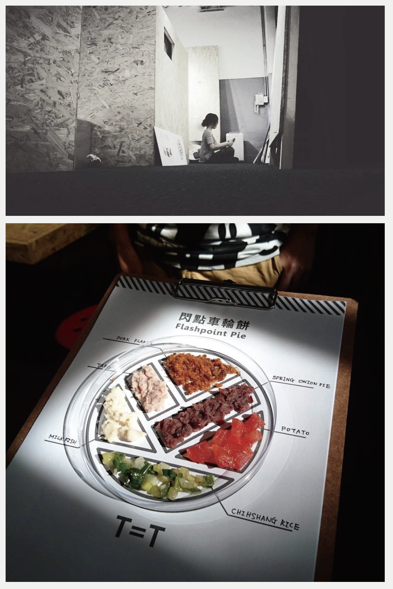
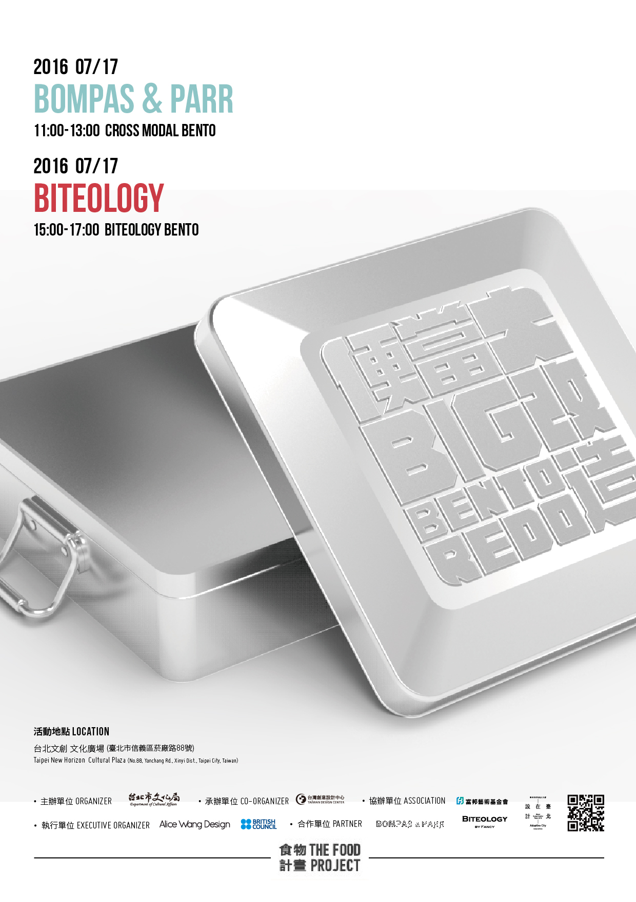
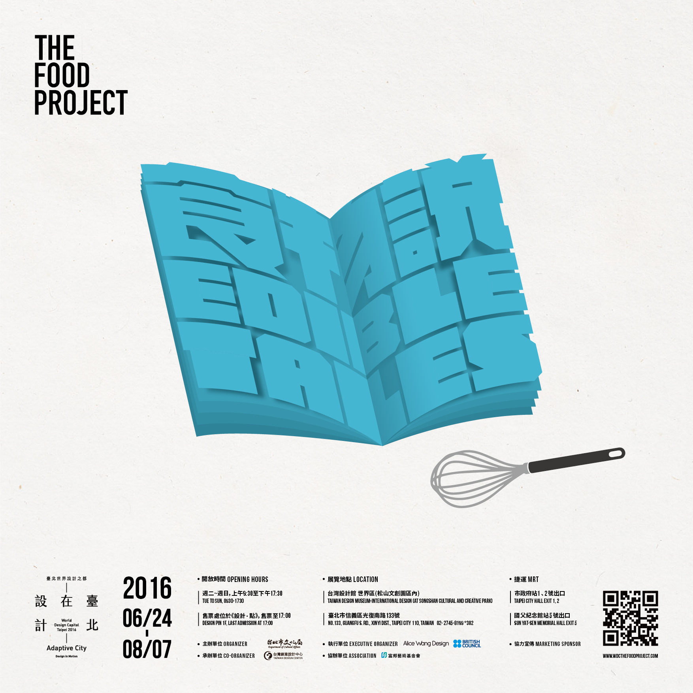
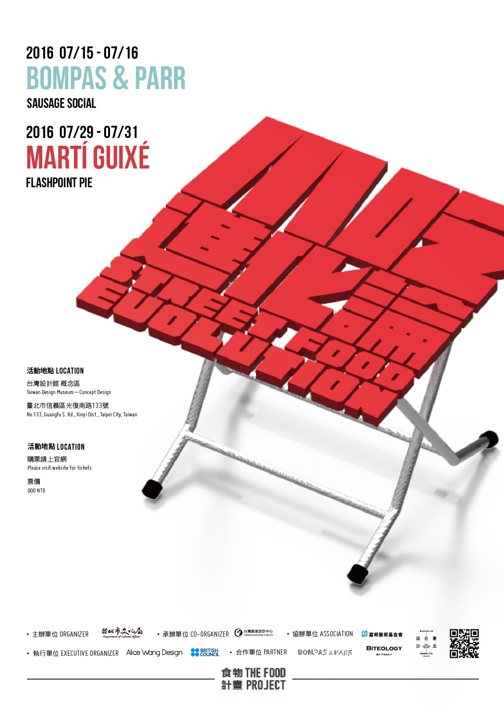

### The Bento reform project

In the Bento reform project , we invited Biteology (bit-eology), which specializes in the use of seasonal ingredients, to Taiwan's agricultural production base: Yunlin. They searched for NG exceptional products in the field and used limited ingredients to bring out their ultimate 
creativity. However, it is impossible to foresee the purchase of ingredients in advance, and it also poses a certain degree of difficulty for bit elearning.
### Exhibition Design

### Poster Design

