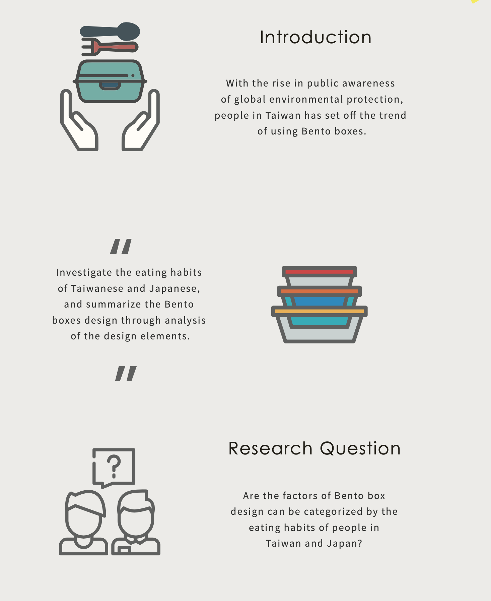
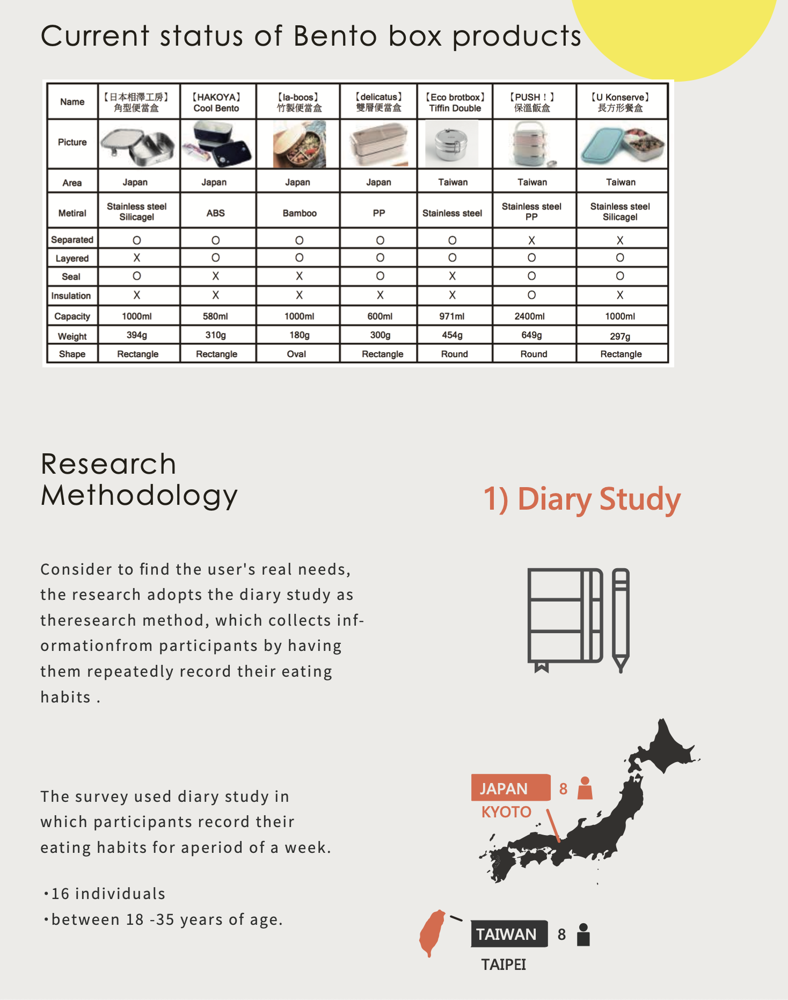
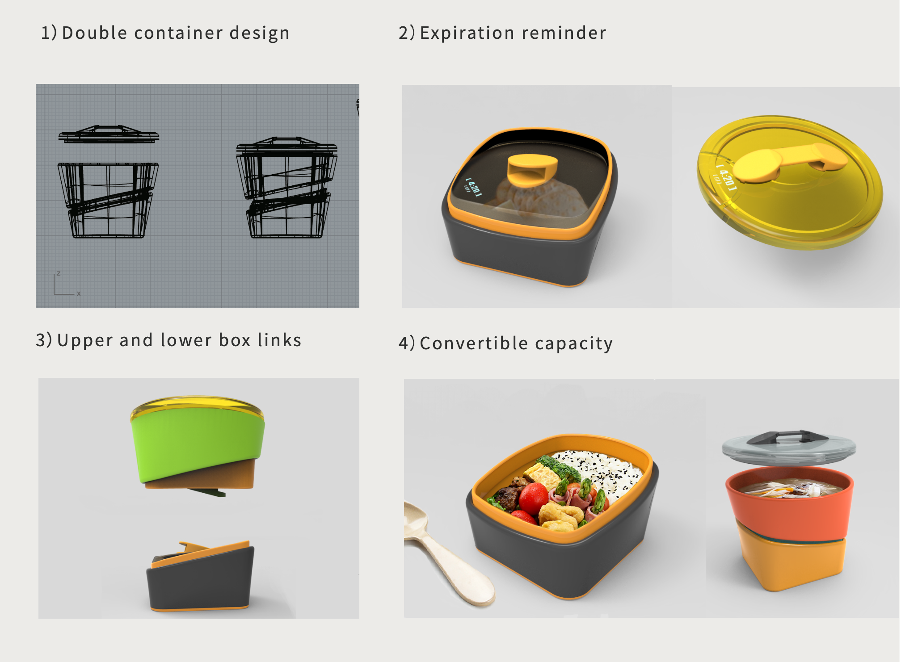
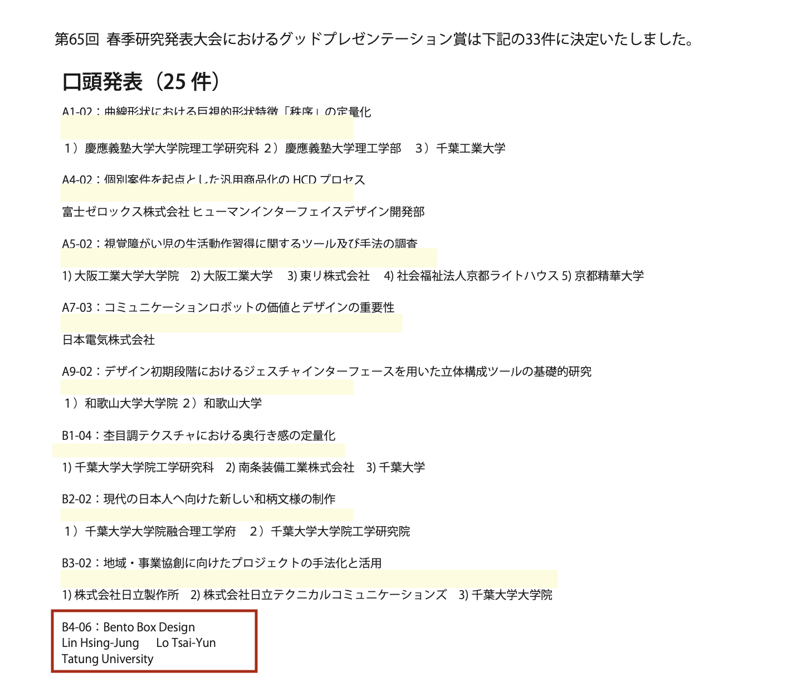

Check the site:<a href="http://www.oit.ac.jp/rd/jssd2018/">日本デザイン学会研究発表大会概要集</a>.

## Introduction
"Bento" plays a very important role in the food culture of Taiwan and Japan. but the food culture is different, the design of the Bento box is different depending on the needs of the user. There are an increasing number of people who use Bento boxes to reduce containers and packaging. Therefore, this study investigated the eating habits of Taiwanese and Japanese, and summarize the Bento boxes design through analysis of the design elements. According to the survey,dishes are usually served in one container in Taiwan.In Japan, food was cooled down and packed in a Bento box, and the "looks" was emphasized. Through analysis of research results, we will explore the feasibility of future research into lunch box design.

Check the site:<a href="http://www.oit.ac.jp/rd/jssd2018/download/good_presentation.pdf">グッドプレゼンテーション賞一覧</a>.

