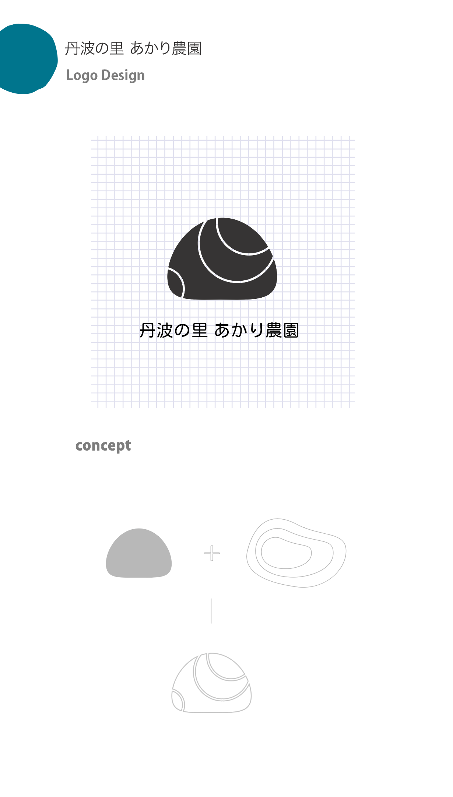

### Proposal_1

ロゴは“丹”、“里” と“農” のカタチ
を組み合わせて、
丹波の里の畑と山を表現しています。

### Proposal_2

農家の力を集めて、ひかりになるを表現しています。
ロゴ全体的明るいのイメージを伝える様に、
色とアウトラインの活発さにデザインポイントします。

### Proposal_3

丹波の土地をベース、畑と山を表現した等高線
のラインと組み合わせて、
ロゴ全体的に丸みを表現し、活発のイメージを
伝える様にします。

