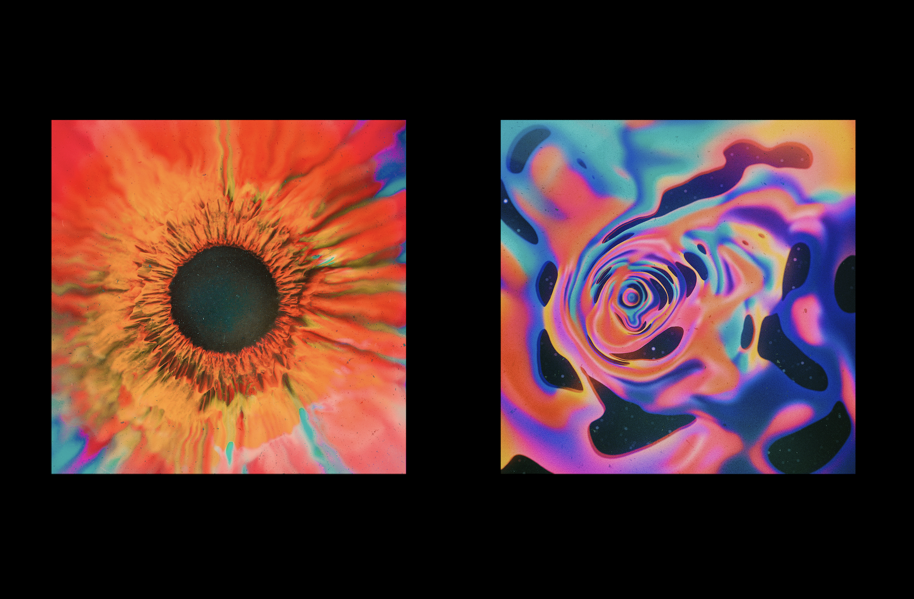

The Department of Industrial Design at Datong University has a long history and is a pioneer in Taiwan's industrial design department. Since its long-term development, it has been eye-catching in both teaching and cooperation with the industry, and has also produced many outstanding alumni.
After four years of design education, the new generation of design exhibitions in May will be the platform for the results to be published. Students will show their four years of hard work and results through the exhibition.
This is a large-scale creative design exhibition held in Taiwan every year. The exhibi- tors take the colleges and universities as the main axis.

